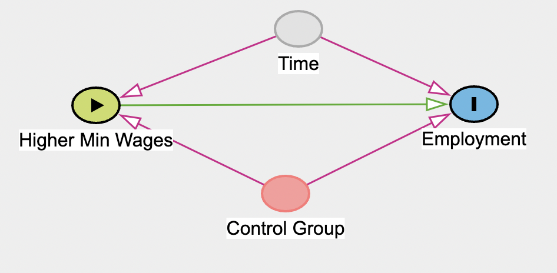
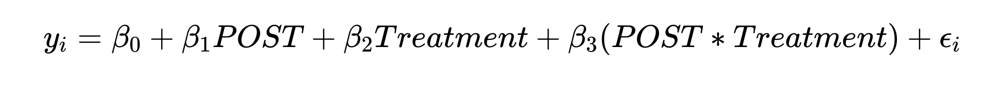
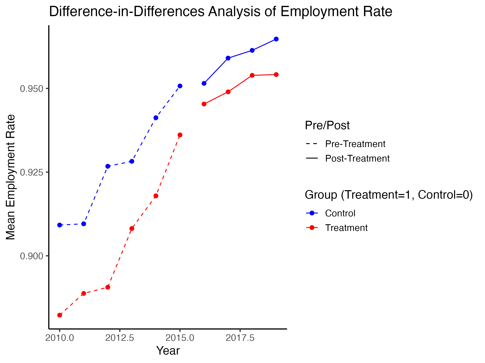
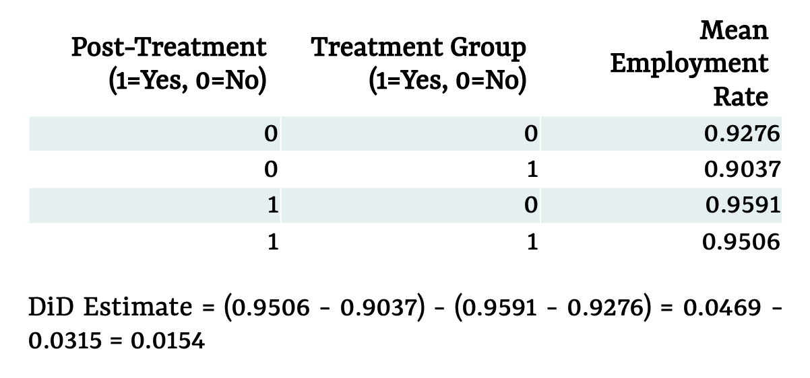
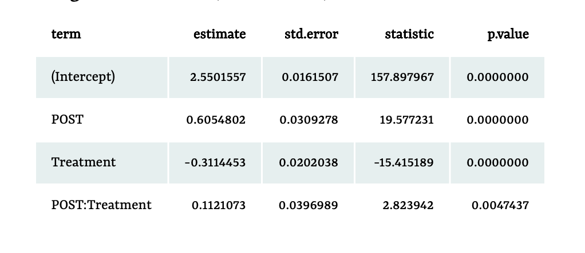

<!-- ## [Tachyons](http://tachyons.io) is a design system that allows you to design gorgeous interfaces in the browser with little effort. -->

---

### Introduction

The impact of minimum wage policies on employment is a
key debate in labor economics, particularly for low and
middle-income workers. While wage increases aim to reduce
inequality and improve living standards, concerns about job
losses among low-wage workers persist. Research shows
mixed findings, with a general consensus that overall
employment is minimally affected, though vulnerable
groups may face challenges. This study uses a Difference-
in-Differences (DiD) approach to examine the effects of
state-level minimum wage increases in 2016, a critical year
when many states implemented higher minimum wages, on
low earners across three treatment states, assessing whether
these policies improved employment outcomes or caused
unintended declines.

### Model

The treatment is the minimum wage increase, and the
outcome is employment status. A control group helps
account for general economic trends over time, isolating the
treatment effect. Treatment group includes California, New
York and Colorado and control group has Texas, Alabama
and Mississippi. Fig 1 confirms the parallel trends
assumption, showing similar trends in mean employment
rates before 2016. A pre-treatment regression showed a
slightly steeper upward trend for the treatment group (0.00195 per year), but it was not statistically significant,
thus supporting parallel trends assumption

I modeled employment status (odds of being employed)
using a logistic regression model with the binary
explanatory variables POST , treatment and the interaction
term POST*Treatment, the DiD estimate capturing the
additional effect of the treatment on the treatment group
after the policy change.

### Data

I sourced data from IPUMS CPS (2010–2019), selecting
Employment Status (EMPSTAT), Labor Force Status, Personal
Income, and Wage and Salary Income for six states. The data
was filtered to include individuals in the labor force earning
below $130,000, resulting in 216,754 observations. The
outcome variable EMP_BIN (1 = employed, 0 = unemployed)
was derived from EMPSTAT. For the DiD analysis, binary
variables POST and Treatment were created. Employment
rates in graphs and tables were calculated as the average of
EMP_BIN.

### Results

*Pre-Treatment Trends (2010–2015)*: The treatment and control groups show parallel trends in employment rates before 2016, meeting the parallel trends assumption. Both groups steadily increased employment. 

*Post-Treatment Trends (2016 onward)*: After treatment, the treatment group experienced a noticeable increase in employment rates, closing part of the gap with the control group. The control group continues to rise in employment, but at a slightly slower rate compared to the treatment group.

*Fig 1. Difference-in-Difference Analysis of Employment Rates*

*Table 1. Average Employment Rates by Treatment and Post-Treatment Status*

The DiD estimate is 0.0154 indicating that after adjusting for
the control group’s employment rate change, the treatment group's employment rate increased by 1.54% more than the control group. This suggests a slight positive effect of the treatment on employment rates in the treatment group.

*Table 2. Estimates for a Model of Employment Status Regressed on POST, Treatment and Their Interaction*

The positive and statistically significant DiD coefficient
(0.1121) indicates that the odds of being employed in the
treatment group increased by approximately 12%
(e^0.1121073 = 1.12) relative to the control group after 2016.

### Discussion
The results suggest that state-level minimum wage increases have a slight positive effect on employment for lower and middle-class populations. 
This supports the broader theory that minimum wage increases can benefit low and middle-income workers without major negative employment effects, making it a viable policy tool for reducing income inequality. This research can be further enriched by incorporating longer time horizons, larger datasets with more states, or examining impact on subgroups like specific industries or demographics. 

### References

1. Cengiz, Doruk, et al.
“The Effect of Minimum
Wages on Low-Wage Jobs.
” The Quarterly Journal of
Economics, vol. 134, no. 3, May 2019, pp. 1405–54. 
2. A. Manning et al.
“The Elusive Employment Effect
of the Minimum Wage.
” Journal of Economic
Perspectives (2016).
3. Georgios Giotis et al.
“Employment Effect of
Minimum Wages.
” Encyclopedia (2022).